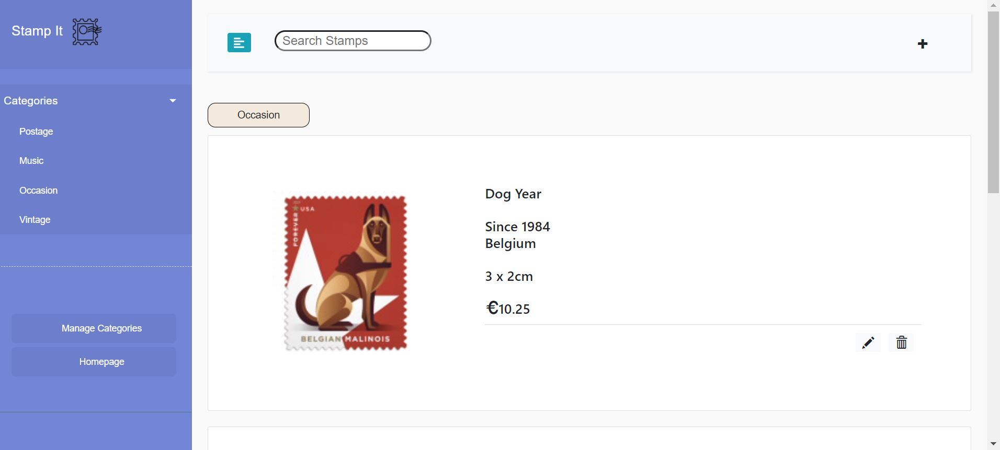
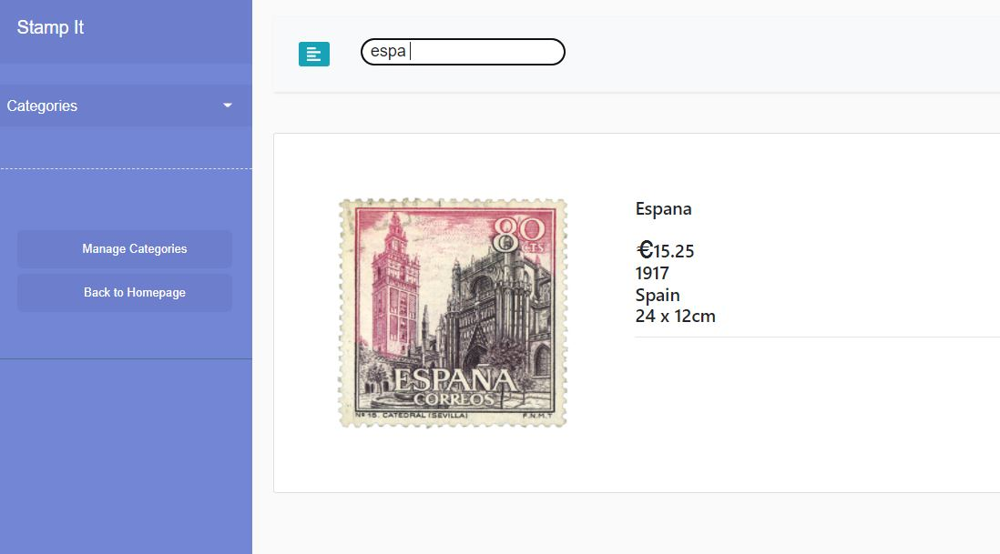
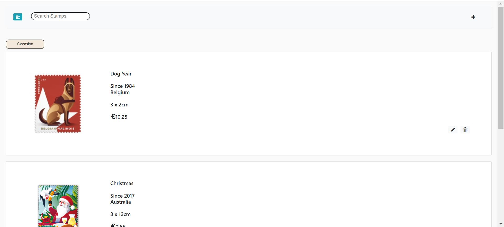
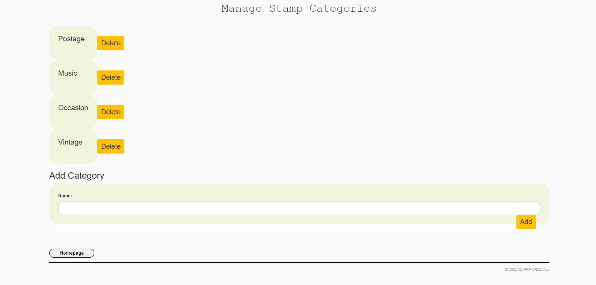
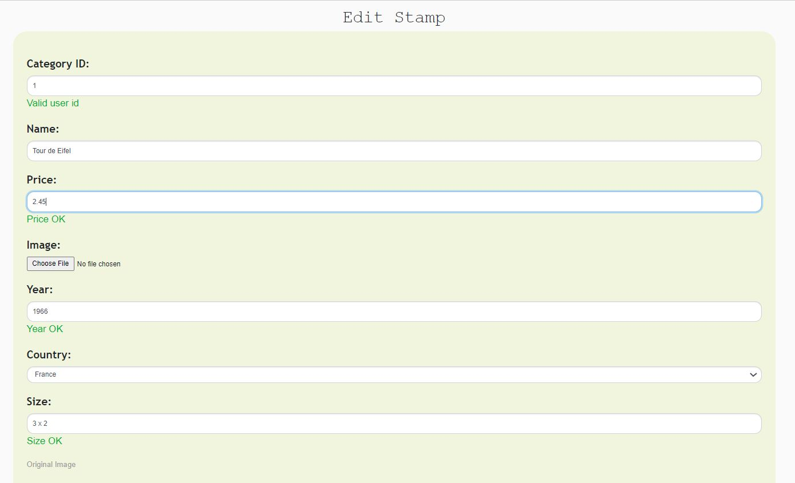

# Stamp It

Browse through a Fascinating Stamps Collection.
### Instructions
* Create a MySQL database called php-crud in PHP MyAdmin
* Run the code in the sql-db.txt file in PHP MyAdmin
* Move the PHP files in to your htdocs folder so Apache can process the PHP code
* Configure the database.php file to connect to your SQL database
---

# Home Page

---

# Search for your favorite stamp

---

# Toggle Sidebar

---

# Manage Stamp Categories

---

# Easy to use Forms

We encourage you to use our App.
Thank you

&copy; DkIT 2022 - Siya Salekar
